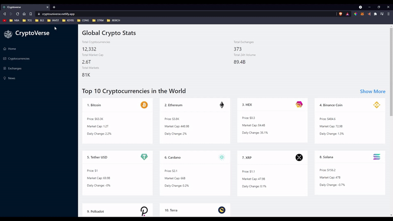
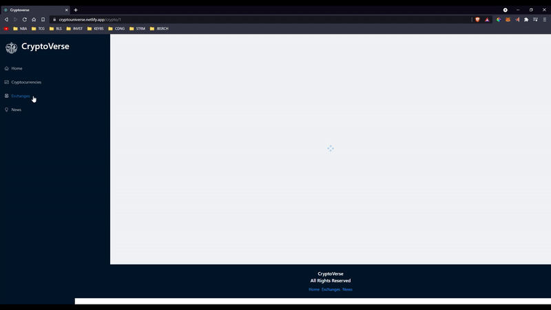
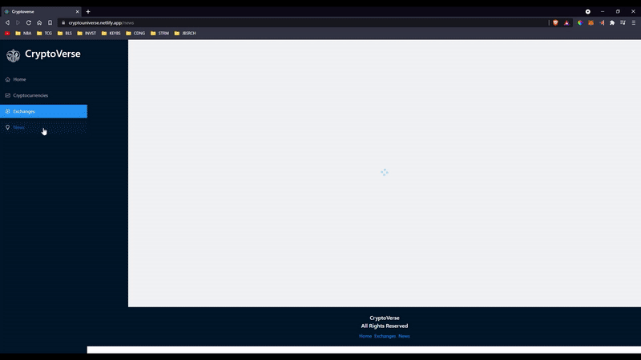

# CryptoVerse

CryptoVerse is a Cryptocurrency website designed to show current prices and infoformation on all cryptocurrencies. It was build with React JS / Redux, utilizes the RapidAPI to fetch all the data needed, and uses stying from Ant Design for a great UX/UI

## Features

- Developed the UI with Ant Design to create an efficient and enjoyable enterprise-level product.
- Integrated RapidAPI to fetch global stats and news for all currencies which processed, analyzed, and rendered data visually.

## Author

Jason Rillera: https://github.com/JasonRillera

## [Live Demo](https://cryptouniverse.netlify.app/)

###### Home Page

###### Crypto Details

###### Crypto Exchanges

###### Crypto News

